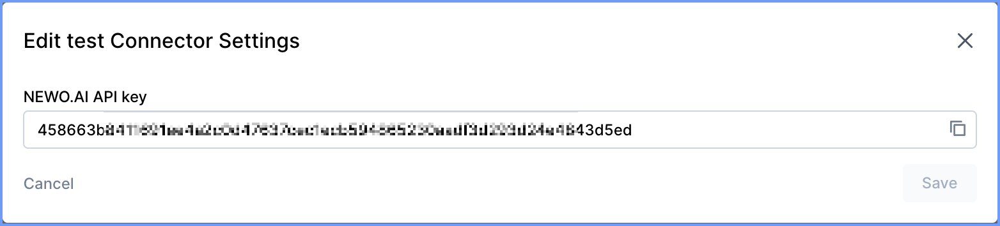

# NEWO CLI

Mass reading attributes of NEWO agents

## Install
```bash
# Clone the repository
git clone https://github.com/constfilin/newo-cli.git
cd newo-cli
npm i
```

## Configure

### Step 1: Get Your NEWO API Key
1. **Login** to your [app.newo.ai](https://app.newo.ai) account
2. **Navigate** to the **Integrations** page
3. **Find** the **API Integration** in the list
4. **Create** a new **Connector** for this Integration
5. **Copy** your API key (it will look like: `458663bd41f2d1...`)

Repeat the above for each project you want to read from



### Step 2: Setup Environment
```bash
cp .env.example .env
# Edit .env with your values
```

Required environment variables:
- `NEWO_BASE_URL` (default `https://app.newo.ai`)
- `NEWO_API_KEYS` (your API keys from Step 1 separated by comma)

## Commands
```bash
npm run help                               # show complete help on command line options
npm run pullProjects                       # download all projects into ./projects/ or into NEWO_PROJECTS_DIR
npm run listProjectBases                   # list base information about projects for each customer
npm run getCustomerProfile                 # list profiles of the customers
npm run getCustomerAttrs                   # list attributes of the customers
```
See more options in output of `npm run help` command

## API Endpoints
- `GET /api/v1/designer/projects` - List all accessible projects
- `GET /api/v1/designer/projects/by-id/{projectId}` - Get specific project metadata
- `GET /api/v1/bff/agents/list?project_id=...` - List project agents
- `GET /api/v1/designer/flows/{flowId}/skills` - List skills in flow
- `GET /api/v1/designer/skills/{skillId}` - Get skill content
- `PUT /api/v1/designer/flows/skills/{skillId}` - Update skill content
- `GET /api/v1/designer/flows/{flowId}/events` - List flow events (for flows.yaml)
- `GET /api/v1/designer/flows/{flowId}/states` - List flow states (for flows.yaml)
- `POST /api/v1/auth/api-key/token` - Exchange API key for access tokens
- `POST /api/v1/akb/append-manual` - Import AKB articles